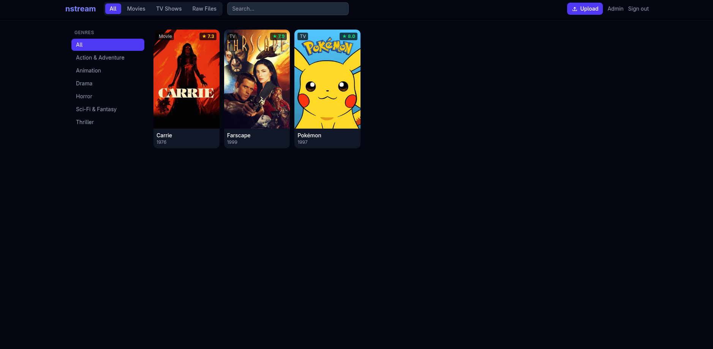
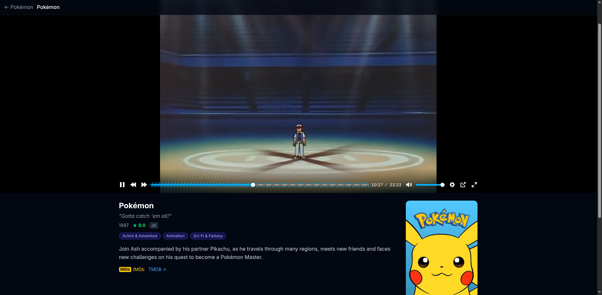
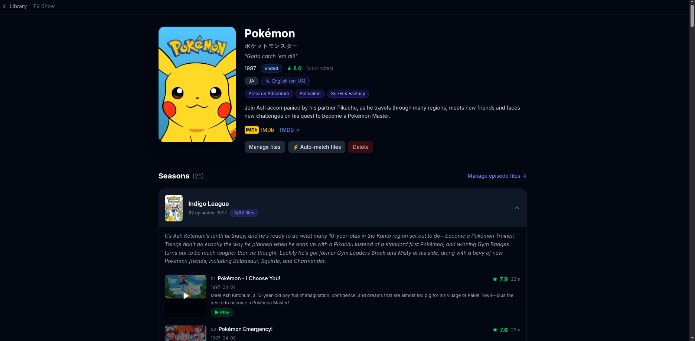
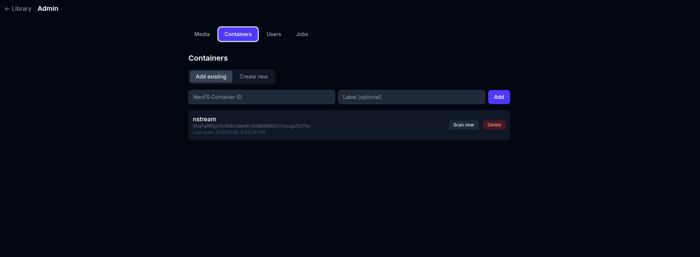

# nstream

A self-hosted NeoFS media platform — stream, browse, and transcode your video
collection stored on the [NeoFS](https://neo.org/neoFS) distributed storage.

## Features

- **Raw streaming** — HTTP byte-range pass-through directly from NeoFS; works with VLC, mpv, ffplay, browsers
- **On-the-fly HLS** — any video is instantly playable as HLS/H.264 via an ffmpeg pipe (no pre-work required)
- **Pre-transcoding** — background job queue encodes to HLS/H.264 and stores the result back to NeoFS
- **Container scanner** — periodically indexes all video objects from configured NeoFS containers
- **React SPA** — mobile-friendly browser UI (Vite + React + Tailwind, embedded into the binary)
  - Library grid with search and pagination
  - Watch page with Plyr + hls.js player
  - Admin panel: containers, users, job queue
- **Multi-user auth** — session cookies, admin/viewer roles, bcrypt passwords
- **SQLite** — zero-dependency embedded database (`modernc.org/sqlite`, no CGO)
- **Single binary** — frontend assets embedded with `//go:embed`

## Screenshots

### Overview


### Player


### Details


### Container management


## Requirements

| Tool | Required | Purpose |
|------|----------|---------|
| Go ≥ 1.21 | yes | build |
| Node ≥ 18 + npm | build-time | frontend |
| ffmpeg | runtime | HLS transcoding (optional) |
| ffprobe | runtime | duration probing during scan (optional) |

## Quick start

```sh
# 1. Build the frontend
cd web && npm install && npm run build && cd ..

# 2. Build the binary (frontend is embedded automatically)
go build ./cmd/nstream

# 3. Configure — edit .env (loaded automatically on startup)
cp .env .env        # already present; edit as needed

# 4. Run
./nstream
```

Open http://localhost:8080 in your browser and sign in with the admin credentials
you set in `NSTREAM_ADMIN_USER` / `NSTREAM_ADMIN_PASSWORD`.

## Configuration flags

All flags can also be set via the corresponding `NSTREAM_*` env variable or the
`.env` file.  Flag > real env var > `.env` value > default.

| Flag | Env | Default | Notes |
|------|-----|---------|-------|
| `-listen` | `NSTREAM_LISTEN` | `:8080` | HTTP listen address |
| `-neofs-endpoint` | `NSTREAM_NEOFS_ENDPOINT` | — | **Required.** e.g. `grpcs://st1.t5.fs.neo.org:8080` |
| `-wif` | `NSTREAM_WIF` | — | WIF private key (mutually exclusive with `-wallet`) |
| `-wallet` | `NSTREAM_WALLET` | — | NEP-6 wallet file path |
| `-wallet-password` | `NSTREAM_WALLET_PASSWORD` | — | Wallet decryption password |
| `-wallet-address` | `NSTREAM_WALLET_ADDRESS` | — | Account address (defaults to change address) |
| `-db` | `NSTREAM_DB` | `./nstream.db` | SQLite database path |
| `-ffmpeg` | `NSTREAM_FFMPEG` | `ffmpeg` | ffmpeg binary |
| `-hls-temp` | `NSTREAM_HLS_TEMP` | OS temp + `/nstream-hls` | HLS segment scratch directory |
| `-scan-interval` | `NSTREAM_SCAN_INTERVAL` | `1h` | Container re-scan frequency |
| `-admin-user` | `NSTREAM_ADMIN_USER` | — | Bootstrap admin username (first run only) |
| `-admin-password` | `NSTREAM_ADMIN_PASSWORD` | — | Bootstrap admin password (first run only) |
| `-job-workers` | — | `2` | Parallel background transcode workers |
| `-dial-timeout` | `NSTREAM_DIAL_TIMEOUT` | `10s` | NeoFS dial timeout |
| `-stream-timeout` | `NSTREAM_STREAM_TIMEOUT` | `30s` | NeoFS stream per-message timeout |
| `-v` | `NSTREAM_VERBOSE` | — | Enable debug logging |
| `-env` | — | `.env` | Path to env file (empty to disable) |

## URL schemes

### Raw streaming (VLC / mpv / ffplay)
```
/stream/{containerID}/oid/{objectID}
/stream/{containerID}/file/{filename}
```

### On-the-fly HLS (browser)
```
/hls/{videoID}/master.m3u8
```

### REST API
```
POST   /api/v1/auth/login          {username, password}
POST   /api/v1/auth/logout
GET    /api/v1/auth/me

GET    /api/v1/videos              ?q=&page=&limit=
GET    /api/v1/videos/:id

GET    /api/v1/containers          [admin]
POST   /api/v1/containers          {cid, name}  [admin]
DELETE /api/v1/containers/:id      [admin]
POST   /api/v1/containers/:id/scan [admin]

POST   /api/v1/jobs                {video_id}   [admin]
GET    /api/v1/jobs                [admin]
GET    /api/v1/jobs/:id            [admin]

GET    /api/v1/users               [admin]
POST   /api/v1/users               {username, password, role}  [admin]
DELETE /api/v1/users/:id           [admin]
```

## Development

```sh
# Run the Go backend (with hot-reload via air or manually)
./nstream -v

# Run the frontend dev server (proxies API to localhost:8080)
cd web && npm run dev
```

Rebuild and re-embed the frontend:
```sh
go generate ./cmd/nstream/
go build ./cmd/nstream/
```

## Bearer tokens (NeoFS)

Append a base64-encoded NeoFS bearer token via:
- Query param: `/stream/...?bearer=<base64>`
- Header: `Authorization: Bearer <base64>`

## Architecture

```
Browser ──── REST + cookie ────► Go API
        ──── HLS segments ─────► /hls/* → ffmpeg pipe → NeoFS
        ──── Range stream ─────► /stream/* → NeoFS GetRange

Scanner (goroutine) ──────────► NeoFS Search → SQLite
Job Runner (goroutine pool) ──► NeoFS Range → ffmpeg → NeoFS Put → SQLite
```
